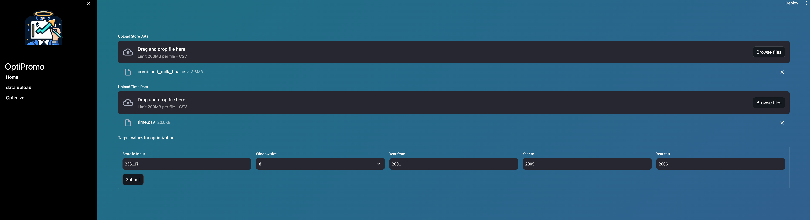
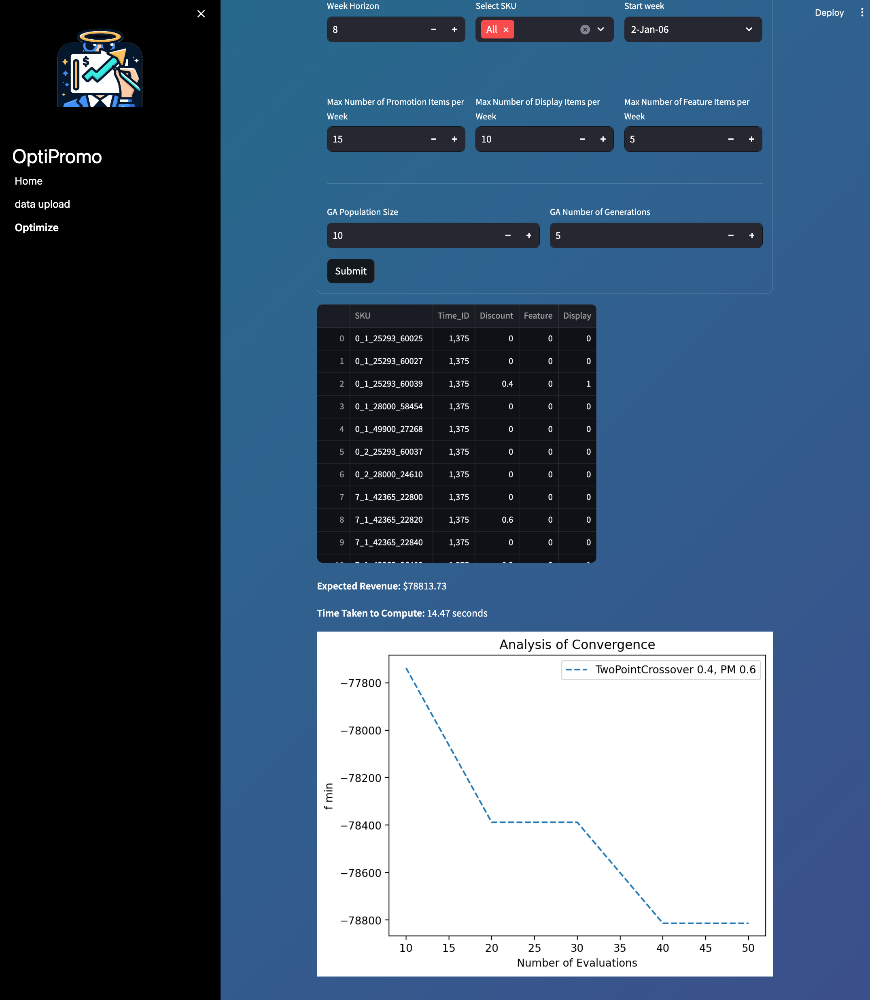

# CS606 AI Planning & Decision Making Group 4: OptiPromo

<center><br><i>Simplify Your Promotions Strategy with OptiPromo and Genetic Algorithms.</i></center>

**Members**

- Henry Low Leng Siang
- Damien Mak Wai Kit
- Teng Kok Wai
- Ian Low Jian Wei
- Anushk Farkiya

## Project Directory Structure

```
├── assets
├── analysis
├── streamlit
├── sample_input
```

- The `analysis` folder contains all notebooks and scripts from problem formulation, GA operators, sensitivity analysis etc.
  - The original IRI dataset originates from [A retail store SKU promotions optimization model for category multi-period profit maximization](https://www.sciencedirect.com/science/article/abs/pii/S0377221716310669). As their implementation uses R, we perform additional data wrangling including segmentation by product category and store, as well as transposing the data to organize it on a per-product-category-per-store basis. This additional manipulation enables more targeted analysis and application in our context.
  - The `1. Demand Function.ipynb` contains our demand function formulation
  - `2. Other Processing.ipynb` contains preprocessing of other essential artifacts such as price list, calendar week, events/holidays etc.
  - `3. Forecast Actual Performance.ipynb` contains our analysis on the acutal revenue and forecast actual revenue.
  - `4. Operator Analysis HPT.ipynb` contains our analysis on the performance of the different operator pairs for our problem. It analyze the outputs from our HPT experiment runs from `operator_analysis.py`
  - `5. Sensitivity.ipynb` contains the code used for our sensitivity analysis.
  - `pop_ga.py` is our GA implementation for this POP problem. It utilizes `revenue_estimation.py` as the fitness function.
- The `streamlit` folder contains the integrated streamlit frontend solution catered for the business users.
- The `sample_input` folder contains the sample csv required to upload to the Streamlit webapp to try.

## Getting Started

- Create and activate conda environment from `environment.yml`

```
conda env create -f environment.yml
conda activate pop
```

### Run the Streamlit webapp

- From the root directory, navigate to the `streamlit` folder and start the streamlit app.

```
cd streamlit
streamlit run Home.py
```

- Navigate to `http://localhost:8501` on the web browser

- Select the `Data Upload` page and upload the files from `sample_input/` respectively.
  - upload the `combined_milk_final.csv` to the first file upload widget. This file contains the post-processed historical sales data for the 36 SKUs in the milk category for all 4 stores.
  - upload the `time.csv` to the second file upload widget. This file contains the calendar metadata such as holidays from 2001 to 2007. These 2 files can be joined by the `Time_ID`/`IRI Week` column.



- As we are generating the promotion schedule on a 8-week basis per store level; we shall key in the following inputs for each field.
  - Store Id Input: `236117`
  - Window Size: `8` (Weeks)
- The following fields are for the demand model function. We have 5 years of historical data to predict for year 2006.
  - Year from: `2001`
  - Year to: `2005`
  - Year test: `2006`
- Press `Submit` to generate the demand model.

- Next, we can navigate to the `Optimize` page and input the relevant parameters to begin Genetic Algorithm computation. Select the folowing parameters:

  - `Week Horizon`: 8 (this should be same as Window Size)
  - `Select SKU`: All or a subset of SKUs
  - `Start Week`: Select the start week of promotion plan
  - `Max Number of Promo items per week`: 15
  - `Max Number of Display items per week`: 10
  - `Max Number of Feature items per week`: 5
  - `GA Population Size`: 10
  - `GA Number of Generations`: 5

- The number of promo items must be less than the number of SKUs uploaded ie. in this case it should be <= 36.
- The number of promo items per week must be less than number of SKUs
- The number of Display and Feature must equal or less than promo items
- The ideal population size should be 1000 and above.
- The number of generations should be at least 5 generation for any meaningful output graph.
- The output table shows the promotion plan for each SKU at each Time_ID. The discount column is a float value from 0.0 to 0.8 where 0.8 translates to 80% discount. Feature and Display are both binary values indicating whether to be on feature or display or not.


